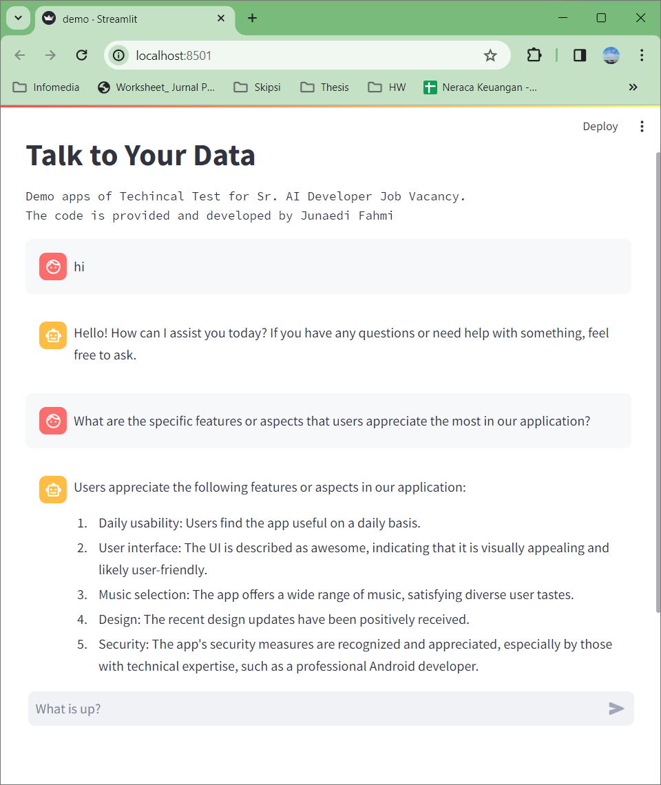

# Diclaimer
This project is to fulfill the technical test for  Sr. AI Engineer at MEKARI.
All the data and code is prohibited to be used outside this purpose. 

# What is this?
This is the project that can do analysis on your data by leveraging LLM capability. In this project I use OpenAI LLM and combined with langchain to make application for your needs. 

# How do we run this?

## Prerequirements
1. Make sure that you have `python 3.11` or higher.
1. Make sure you have your OpenAI Secret key, you can find your from [here](https://help.openai.com/en/articles/4936850-where-do-i-find-my-api-key).
1. Create a `.env` file where the inside is `OPENAI_API_KEY=XXX`. Replace the XXX with your OpenAI secret key you got earlier.
1. Install the python `pip install -r requirements.txt`
2. Make sure that you have the data source from [here](https://drive.google.com/file/d/1_xaRB6d2K_9-1dUmdU0GjtaqPO7uQnTM/view?usp=sharing).


## Running the code
After all the prerequirements are fulfilled you can run the code by running this commands:
```
streamlit run demo.py
```

you can open your browser and head to your `localhost:8501` and can start using this app.


